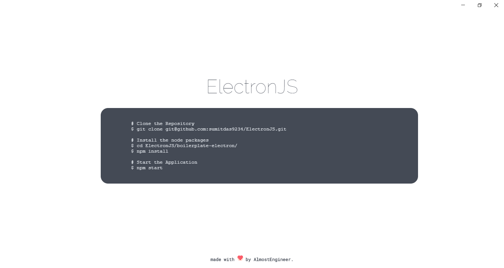

# boilerplate-electron

## Introduction

This is a simple quickstart Electron JS application template with a few handy `npm` scripts and templating engine integration.

## Guide

### Setting up the project on your local machine

```shell
# Clone the Repository
git clone git@github.com:sumitdas9234/boilerplate-electron

# Install the node packages
cd boilerplate-electron/
npm install
```

### Project Structure

```
├───assets
│   ├───css
│   ├───images
│   └───js
├───templates
│   └───index.html
└───main.js
```

### Starting the application

```shell
# Start the Application
npm start
```


Here is what you should see when you clone, installed packages and start the app in local.


